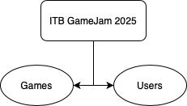

# T1. PR2. REST API - Álvaro Cobo

## Project Description

This project consists of a complete web application developed with .NET technologies, which includes a REST API and a client consuming that API. The project is designed to manage a video game catalog, allow users to register, log in, rate games, and communicate via a chat.

## Project Structure

### API Project

The REST API is built with ASP.NET Core and provides several endpoints to manage:
- **User Authentication**: Registration, login, and role management (regular user and administrator)
- **Game Management**: Listing, retrieving details, adding, updating, and deleting games
- **Voting System**: Allows registered users to upvote or remove their vote on games

The API uses:
- Entity Framework Core for data persistence
- JWT (JSON Web Tokens) for user authentication and authorization
- SignalR for real-time communication

#### API Architecture and Controllers

The API follows a RESTful architecture and is organized into the following main controllers:

- **AuthController**: Handles all authentication and authorization logic:
  - `POST /api/auth/register`: Register regular users
  - `POST /api/auth/admin/register`: Register users with administrator role
  - `POST /api/auth/login`: Validate credentials and generate JWTs

- **GamesController**: Provides all CRUD operations for games:
  - `GET /api/games`: Returns all available games
  - `GET /api/games/{id}`: Retrieves data for a specific game
  - `POST /api/games`: Creates a new game (requires administrator role)
  - `PUT /api/games/{id}`: Updates game data (requires administrator role)
  - `DELETE /api/games`: Deletes a game (requires administrator role)
  - `POST /api/games/vote`: Allows a user to vote or unvote a game (requires authentication)

#### Security and Validation

The API implements a robust security system:

- **JWT Authentication**: All protected endpoints require a valid JWT
- **Role-Based Authorization**: Certain operations are available only to users with the appropriate role
- **Identity Framework**: ASP.NET Identity is used to manage users, passwords, and roles
- **Password Validation**: Enforces password rules (minimum length, complexity requirements)

#### Models and Relationships

The API database is structured with the following main entities:

- **User**: Extends ASP.NET IdentityUser and adds:
  - Custom properties like `Name`
  - Many-to-many relationship with rated games (`RatedGames`)

- **Game**: Represents each video game with:
  - Basic properties like `Title`, `Description`, `DeveloperTeam`, and `ImageUrl`
  - Many-to-many relationship with users who have rated the game (`RatedUsers`)

### Database Diagram

The database structure uses Entity Framework Core to manage entity relationships:

- **Main Tables Created Manually**:
  - **Games**: Stores information about video games (Id, Title, Description, DeveloperTeam, ImageUrl)
  - **Users**: Extends AspNetUsers from Identity Framework and adds custom properties (Name)

- **Many-to-Many Relationship**:
  - Between `Users` and `Games`, allowing one user to rate many games and one game to be rated by many users
  - Entity Framework automatically creates a join table to manage this relationship
  - The join table contains foreign key pairs linking users and games

- **Tables Generated by ASP.NET Identity**:
  - AspNetRoles, AspNetUserRoles, AspNetUserClaims, etc., to manage role-based authentication and authorization

This setup allows great flexibility in queries and relationships while Entity Framework handles the complexity of join tables and relationships.

### Client Project

The client is developed with ASP.NET Core using the Razor Pages pattern and provides a user interface to:
- Register and log in
- View the game catalog
- See details of each game
- Rate games (if the user is authenticated)
- Chat with other users in real time
- Manage games (create, update, delete) if the user has an administrator role

#### Client Services

The client project implements a centralized service pattern to handle communications with the API:

- **AuthService**: Centralizes all authentication logic, managing:
  - User login by sending credentials to the API
  - Processing and storing JWTs
  - Converting JWT claims into client authentication cookies
  - Handling logout

- **GameService**: Facilitates all game-related operations:
  - Retrieving the list of games from the API
  - Fetching details of individual games
  - Managing game votes
  - Handling API communication errors

- **AuthenticationDelegatingHandler**: An interceptor that automatically adds the JWT to all HTTP requests, allowing access to protected resources without handling authentication logic in each request.

This service architecture ensures a clear separation of concerns and makes the application easy to maintain and extend.

## Technologies Used

- **Backend**: ASP.NET Core, Entity Framework Core, SignalR
- **Frontend**: Razor Pages, Bootstrap
- **Security**: JWT, Identity Framework
- **Database**: SQL Server

This project demonstrates a full client-server architecture with authentication, authorization, and real-time communication.

## Bibliography
- Auth0. (January 5, 2025). JWT Authentication Guide for ASP.NET Core. Auth0 Docs. Retrieved April 17, 2025, from [link](https://auth0.com/docs/quickstart/backend/aspnet-core-webapi)
- Microsoft. (March 15, 2025). Create a REST API with ASP.NET Core. Microsoft Docs. Retrieved April 17, 2025, from [link](https://learn.microsoft.com/es-es/aspnet/core/web-api/?view=aspnetcore-7.0)
- Microsoft. (February 1, 2025). ASP.NET Core Identity. Microsoft Docs. Retrieved April 21, 2025, from [link](https://learn.microsoft.com/es-es/aspnet/core/security/authentication/identity)
- Eniun. (n.d.). Bootstrap 5 Class Cheat Sheet. Eniun. Retrieved April 19, 2025, from [link](https://www.eniun.com/resumen-clases-bootstrap-5-cheat-sheet/)
- W3Schools. Bootstrap Classes Reference. Retrieved April 20, 2025, from [link](https://www.w3schools.com/bootstrap/bootstrap_ref_all_classes.asp)
